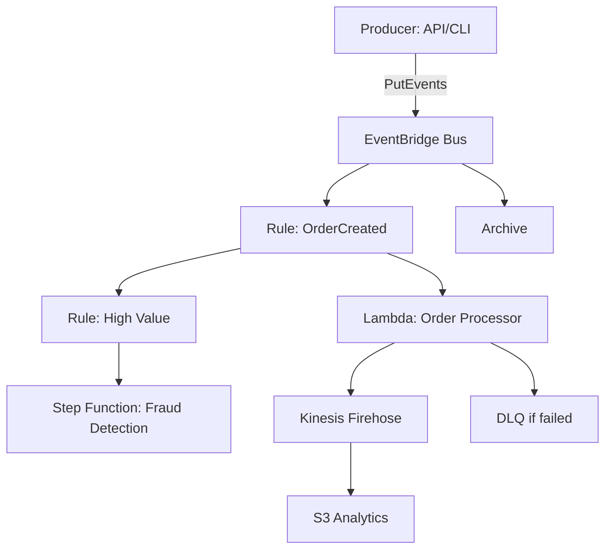

# EventBridge Order Platform

A real-time order processing platform built on AWS EventBridge. Demonstrates event-driven architectures: routing, enrichment, analytics, fault tolerance, schema registry, archive & replay.

## Features
- Custom EventBridge event bus (`orders-bus`)
- EventBridge Rules routing to Lambda and Step Functions
- Schema registry and validation
- Firehose → S3 analytics pipeline
- Dead-letter queue and retry policies
- Archive & Replay for reproducible debugging
- CI/CD via GitHub Actions (Terraform)

## Quickstart
1. Configure AWS creds:
   ```bash
   aws configure
   ```
2. Deploy infra:
   ```bash
   cd infra
   terraform init
   terraform apply
   ```
3. Build and upload lambdas:
   ```bash
   cd ../src/lambdas/order_processor
   pip install -r requirements.txt -t build/
   cp handler.py build/
   cd build && zip -r ../order_processor.zip .
   # Upload the zip to S3 or use Terraform to reference local path
   ```
4. Send a test event:
   ```bash
   cd ../../producer
   node send_order.js
   ```

## Architecture


## Demo
[Add short GIF or video here]

## Cost
Small — mostly Lambda invocations, Firehose data transfer, S3 storage. Estimate: <$10/month for low traffic. Use budget alerts in AWS.

## Cleanup
```bash
cd infra
terraform destroy
```

## License
MIT
